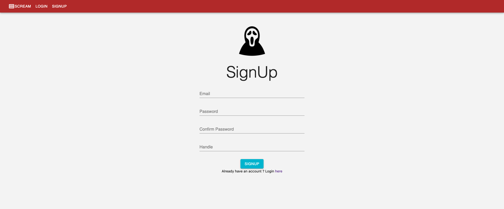

  

 <strong> SCREAM </strong> 

## What's SCREAM about?
Scream is a platform open for all, where one can speak their minds freely without fear of oppression.
Call it your new hangout place!

## 1: To go to the live app, visit the link down below:

1. [Visit here!](https://socialape-c629a.web.app/login)
2. SCREAM main page will show as the below picture. 

3. Login if you already have an account. Otherwise, click on "SIGNUP" on the top. 
4. The following page should show if are trying to create a new account. Fill in the relevant information and click "SIGNUP" on the bottom. 

5. After logging in, the home page looks something akin to this - 

## 2: Steps to run the project locally:

Navigate to ./social_media_client

run `rm -rf node_modules && npm install`

run `npm start`

go to [http://localhost:3000](http://localhost:3000) (though it should pop-up automatically, if it doesn't click this link.)

## Manually test through the app and fill out the survey: (https://tinyurl.com/y67dkvrw)
We would love your valuable input to get the web app to function better!

## Link to the video
[You can find the video here](https://youtu.be/oUbFHFr1MX8)

## Watch out for this space!
Currently looking for people 
- who'd be willing to explore our platform, 
- help us iron out the kinks,
- and if interested, spread the word about us as well!

Keep a look out on this space for more updates!

## Tech Stack
ReactJs,Firebase,Redux,ExpressJS

## Group Info
1. Ayush Bisht 
2. Sakshi Deshpande
3. Ananya Nunna
4. Vijay Anand
5. Dhanraj Raghunathan

